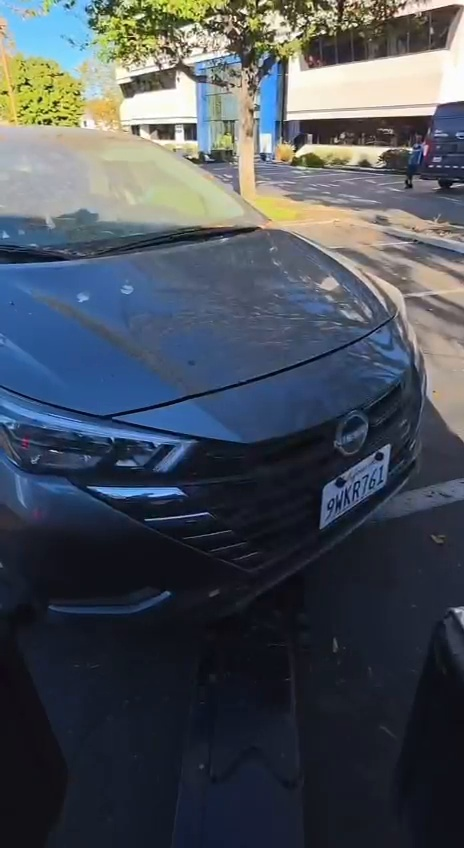

# HaveIBeenTowed

**BAY HACKS AI-track winning team project.** Originally built by the [Have I Been Towed team](https://github.com/Have-I-been-towed/have-i-been-towed). This fork is maintained by [Adham Mater](https://github.com/AIOLABN); the award belongs to the original team project.

A computer-vision prototype that helps drivers find reviewed towing records using their license plate and registration state.

[Watch the sample clip](https://github.com/AIOLABN/have-i-been-towed/blob/main/public/media/tow-demo.mp4) — recorded camera footage used by the prototype, not a live deployment or an end-to-end product walkthrough.

[Quick start](#run-locally) · [Architecture](#architecture) · [Worker setup](worker/README.md) · [Deployment](DEPLOY.md)

Camera footage is processed into plate candidates. An operator reviews the evidence before a record becomes searchable.

## Run locally

Requires Node 22.13+ for the web application and Python 3.11+ for the video worker.

~~~sh
pnpm install --frozen-lockfile
cp .dev.vars.example .dev.vars
# Set the local secrets in .dev.vars before continuing.
pnpm db:migrate:local
pnpm dev
~~~

Open the URL printed by Vinext. To serve the production bundle locally:

~~~sh
pnpm build
pnpm start
~~~

Set your operator email, password, session secret, and lookup salt in `.dev.vars`. On Windows PowerShell, use `Copy-Item .dev.vars.example .dev.vars` instead of `cp`. The local D1/R2 preview state is disposable and lives under `.wrangler/`. Production uses the D1 database and R2 bucket declared in `wrangler.jsonc`; see [`DEPLOY.md`](DEPLOY.md).

## What works

**Public lookup**, at `/`, accepts an exact license plate and registration state. It returns only a published match. A missing result is intentionally inconclusive: this prototype is not connected to every towing company, city, or police database.

**Detection studio**, at `/detection`, is the operator workspace. It includes the recorded sample journey, a private upload queue, worker connection instructions, and processing status. Uploads are limited to five waiting jobs and 20 MB per video.

**Review workflow**, at `/evaluation`, keeps the sample record separate from an operator's live records. An operator can inspect the frame, verify the plate and state, confirm the supplied destination, then publish or reject the candidate. Pending evidence is not returned by public lookup.

The API is served by the same application. `GET /api/status` reports database readiness and, for an approved operator, whether that operator's worker has sent a recent heartbeat.

## Architecture

1. An authorized operator uploads a short camera clip with a registration state, camera or truck ID, and tow destination.
2. The Python worker claims the queued job and runs the supplied FastALPR pipeline with plate detection, OCR, relative-motion tracking, and multi-frame voting.
3. The worker returns up to five candidates and supporting snapshots. Candidates are stored as private evidence with `pending` review status.
4. A person checks the full plate, registration state, frame, and destination. Publication is an explicit action.
5. The public lookup matches the exact normalized plate and state against published records only.

OCR confidence describes the plate read. It is not the probability that a vehicle was towed. Ambiguous tracks are rejected rather than promoted by a stronger label.

## Demo and data boundaries

The sample experience uses the original `tow_test.mp4` project footage and its saved evidence. The sample plate (`9WKR761`, California) is marked as a historical demo and is never mixed into live lookup results.

This is an independent prototype, not a municipal or tow-company registry. It does not establish that a vehicle is currently impounded, guarantee that every tow is represented, or replace posted-property instructions and local non-emergency services. Confirm pickup details with the operator that supplied the destination.

Raw uploaded footage is deleted after successful processing. A deletion failure is recorded and retried on later worker heartbeats or claims. Review snapshots remain as evidence; queued and failed footage stays private for diagnosis. Upload only footage that you are authorized to process.

## Worker

The web application and API run together; computer-vision processing runs in a separate Python process. It makes outbound HTTPS requests to the deployed application; it does not need an inbound port, public IP, or tunnel.

See [`worker/README.md`](worker/README.md) for Docker and Python instructions. The short version is:

~~~sh
cd worker
docker build -t haveibeentowed-worker .
~~~

Then open **Detection studio → Connect worker**, sign in as an approved operator, generate a connection key, and run the command shown there. Keys are shown once, expire after 90 days, and generating a new key revokes the previous one. Deploying the web application does not start the worker automatically.

The worker uses a 15-minute job lease and a 12-minute inference timeout. Interrupted jobs can be reclaimed; after three attempts a job is marked failed. Keep the worker host powered on while jobs are queued.

## Configuration

Locally these live in `.dev.vars` (see `.dev.vars.example`); in production they are Cloudflare Worker variables and secrets (see `DEPLOY.md`):

~~~sh
OPERATOR_EMAILS=operator@example.com
OPERATOR_PASSWORD=a-long-shared-password
SESSION_SECRET=a-long-random-string
LOOKUP_SALT=use-a-local-random-value
~~~

`OPERATOR_EMAILS` is a comma-separated allowlist and `OPERATOR_PASSWORD` is the shared operator password. Operators sign in at `/login`; a signed, HttpOnly session cookie (keyed by `SESSION_SECRET`) lasts seven days and is re-checked against the allowlist on every request. Sign-in is rate limited. The allowlist gates uploads, worker-key generation, and evidence review; it is not a general role system. Anonymous visitors can use the public lookup, subject to a per-IP rate limit when Cloudflare provides the request IP.

## Authentication limitations

The shared operator password is intended for a controlled demo. Email addresses are checked against an allowlist but ownership of an email address is not verified. Anyone with the shared password can sign in as another allowlisted operator, so account-scoped records do not provide isolation between people who share that password.

Before using this with independent operators or real sensitive records, replace shared credentials with individual authenticated accounts, verified identities, and per-user revocation. MFA and an audit trail are also needed for an operational deployment. These controls are not implemented in this prototype. Changing the shared password does not invalidate existing sessions; rotate `SESSION_SECRET` to invalidate all sessions, or remove an email from `OPERATOR_EMAILS` to disable that identity.

## Privacy & responsible use

License plates, timestamps, destinations, and camera images can reveal information about a person's movements. Exact plate-and-state matching reduces casual browsing but is not proof that the requester owns the vehicle.

- **Collection:** process only footage you are authorized to use. Avoid unrelated people and vehicles; redact identifying details in any public demo material where needed. The bundled clip is historical sample footage, not a current towing record.
- **Publication:** candidates remain private until an operator publishes them. A published match exposes the plate, time, destination, truck ID, source filename, confidence, and supporting snapshot. Published snapshot URLs can be accessed directly by anyone with the URL.
- **Withdrawal:** marking a record rejected removes it from lookup and public snapshot access. This does not erase the stored record or copies someone has already downloaded.
- **Retention:** successfully processed raw uploads are deleted, with retries after failures. Pending or failed uploads, records, and review snapshots have no automatic expiry. Set and enforce a retention schedule before an operational deployment.
- **Requests and misuse:** a deployment needs an operator contact for corrections and deletion requests, plus monitoring for repeated lookups. The prototype has no self-service deletion process. Lookup rate limits depend on Cloudflare supplying the client IP and do not prevent all enumeration.

Use synthetic or appropriately redacted data for demonstrations. Do not use the prototype to track individuals or treat an OCR result as proof of a current tow.

## Repository layout

~~~text
app/                 Vinext pages, API route, and client workspace
lib/                 API handlers, validation, access checks, and types
db/                  D1 access and schema declarations
drizzle/             D1 migrations
worker/              Python/FastALPR worker and Docker image
public/media/        Clearly marked sample footage and evidence
tests/               Node, D1/R2 integration, and Python worker tests
wrangler.jsonc       Worker entry, D1/R2 bindings, and variables
edge/                Cloudflare Worker entry point
lib/auth.ts          Operator sign-in and signed session cookies
~~~

## Validation

GitHub Actions runs the build, Node tests, D1/R2 integration suite, Python worker test, and Python compilation on pushes and pull requests. The badge above reflects the actual workflow status. CI does not run model inference or validate OCR accuracy.

Run the same checks locally:

~~~sh
pnpm build
pnpm test
python3 -m compileall -q worker
~~~

The integration suite exercises the real D1/R2 emulation, including owner scoping, stale leases, idempotent completion, private evidence, exact plate-and-state lookup, and durable raw-footage cleanup:

~~~sh
node tests/api.integration.mjs
~~~

The thresholds, model configuration, and demo data are retained from the supplied project. They are engineering settings for this prototype, not validated towing, legal, or safety determinations.

## Deployment

The web application is a Vinext (Next-compatible) app that runs as a Cloudflare Worker with D1 and R2 bindings. `pnpm deploy` builds and publishes it to a free `*.workers.dev` address, and a custom domain can be attached in the Cloudflare dashboard. Step-by-step instructions are in [`DEPLOY.md`](DEPLOY.md). The Python worker remains a separately managed process and must be connected with its short-lived worker key after deployment.

## Project background

The original team project is available at [Have-I-been-towed/have-i-been-towed](https://github.com/Have-I-been-towed/have-i-been-towed). This fork retains its Git history and adds the updated web application and worker. Repository commit authors are not necessarily a complete list of hackathon participants.

## Licensing

No project-wide open-source license has been declared for this fork or its upstream repository. A license should be agreed with the relevant contributors before one is added. Third-party libraries, model weights, and sample media may have separate terms; a future code license should identify those exclusions.
